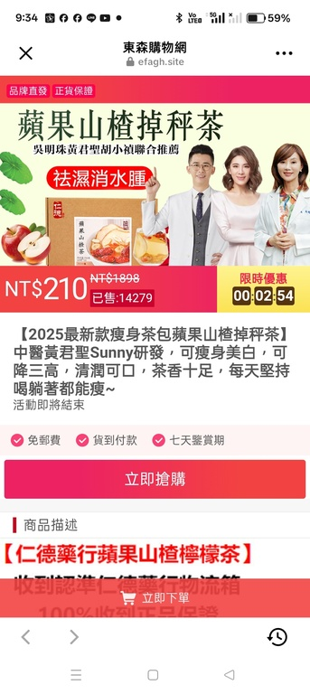

# 內容風險 (截圖) 查詢 API

## 概覽

上傳截圖後非同步處理，再以 `job_id` 查詢結果。

| 項目 | 值 |
|------|-----|
| 上傳 Endpoint | `POST /content-check` |
| 查詢 Endpoint | `GET /content-check/{job_id}` |
| 上線狀態 | ✅ 已上線 |
| Rate Limit | 每組 API Key 限 **20 RPM**，短暫 Burst 上限 **3** |

> API Key 取得方式與除錯說明請參考 [README](../README.md)。

---

## 使用流程

```
1. POST /content-check          → 上傳截圖（JSON + base64），取得 job_id
2. GET  /content-check/{job_id} → 輪詢查詢結果，直到 status = 3（success）
```

---

## 請求格式

### 1. 上傳截圖

**Method**：`POST`

**URL**：`https://hljaj2f6gf.execute-api.ap-northeast-1.amazonaws.com/prod/content-check`

**Headers**：

| Header | 必填 | 說明 |
|--------|------|------|
| `x-api-key` | ✅ | 各隊專屬 API Key |
| `Content-Type` | ✅ | `application/json` |
| `Accept-Language` | ❌ | 分析報告輸出語系。支援值：`zh-TW`、`th-TH`、`ja-JP`、`ms-MY`、`fil-PH`、`en-US`、`pt-BR`、`ko-KR` |

**Request Body**：

| 欄位 | 型別 | 必填 | 說明 |
|------|------|------|------|
| `region` | string | ✅ | 地區設定，影響 AI 對圖片的理解及補充資料。支援值：`TW`、`TH`、`JP`、`MY`、`PH`、`HK`、`BR`、`KR`、`SG` |
| `image` | string | ✅ | Base64 編碼圖片。支援純 base64 字串或 data URI 格式（`data:image/jpeg;base64,...`） |

**支援圖片格式**：JPEG / JPG / PNG

**範例**：

```bash
# 方式一：純 base64 字串
IMAGE_B64="$(base64 -i screenshot.jpg)"

curl -X POST "https://hljaj2f6gf.execute-api.ap-northeast-1.amazonaws.com/prod/content-check" \
  -H "x-api-key: <YOUR_API_KEY>" \
  -H "Content-Type: application/json" \
  -H "Accept-Language: zh-TW" \
  -d "{\"region\": \"TW\", \"image\": \"${IMAGE_B64}\"}"

# 方式二：data URI 格式
IMAGE_B64="data:image/jpeg;base64,$(base64 -i screenshot.jpg)"

curl -X POST "https://hljaj2f6gf.execute-api.ap-northeast-1.amazonaws.com/prod/content-check" \
  -H "x-api-key: <YOUR_API_KEY>" \
  -H "Content-Type: application/json" \
  -H "Accept-Language: zh-TW" \
  -d "{\"region\": \"TW\", \"image\": \"${IMAGE_B64}\"}"
```

**Response**（200 OK）：

```json
{
  "job_id": 76246
}
```

---

### 2. 查詢結果

**Method**：`GET`

**URL**：`https://hljaj2f6gf.execute-api.ap-northeast-1.amazonaws.com/prod/content-check/{job_id}`

**Headers**：

| Header | 必填 | 說明 |
|--------|------|------|
| `x-api-key` | ✅ | 各隊專屬 API Key |
| `Accept-Language` | ❌ | 分析報告輸出語系（同上傳支援值） |

**範例**：

```bash
curl "https://hljaj2f6gf.execute-api.ap-northeast-1.amazonaws.com/prod/content-check/76246" \
  -H "x-api-key: <YOUR_API_KEY>" \
  -H "Accept-Language: zh-TW"
```

**Response**（200 OK）：

```json
{
  "id": 76246,
  "status": 3,
  "category": "POTENTIAL_SCAM",
  "title": "建議向官方來源求證，確保資訊屬實。",
  "content": [
    "1. 號碼與網址：未發現風險",
    "2. 用戶回報：目前無相關資訊",
    "3. 公開資訊：發現相似詐騙案例的討論"
  ],
  "created_at": "2026-03-03T03:58:12Z",
  "image_url": "https://static-staging.whoscall.com/...",
  "urls": [
    {"url": "example.site", "level": "SAFE"}
  ],
  "numbers": [],
  "news": [
    {"title": "...", "url": "...", "date": "2026/03/03", "source": "SERPER"}
  ],
  "kindly_reminder": "請注意..."
}
```

**status 值說明**：

| 值 | 說明 |
|----|------|
| `0` | pending（等待處理） |
| `1` | in-progress（處理中） |
| `2` | failed（處理失敗） |
| `3` | success（完成） |

**category 值說明**：

| 值 | 說明 |
|----|------|
| `SAFE` | 安全內容 |
| `NO_RISK_FOR_NOW` | 目前無風險 |
| `POTENTIAL_SCAM` | 疑似詐騙 |
| `SCAM` | 詐騙內容 |

---

## 錯誤碼

| HTTP Status | 原因 | Response Body |
|-------------|------|---------------|
| `400` | 缺少必填欄位（region / image） | `{"error": "Missing required fields: region and image"}` |
| `400` | Request body 非合法 JSON 或 base64 格式錯誤 | `{"message": "Invalid JSON body"}` / `{"message": "Invalid base64 image"}` |
| `401` | API Key 或 Secret 無效 | `{"error": "Invalid API key or secret"}` |
| `403` | `x-api-key` 未提供或無效 | API Gateway 標準錯誤訊息 |
| `404` | 查詢的 job_id 不存在 | `{"error": "Record not found"}` |
| `429` | 超過 Rate Limit（20 RPM / Burst 3） | `{"message": "Too Many Requests"}` |
| `500` | 上游內部錯誤 | `{"error": "Internal server error: [message]"}` |
| `502` | 上游回傳非預期錯誤 | `{"message": "Upstream error: <status>"}` |
| `503` | 上游憑證暫時無法取得 | `{"message": "Service temporarily unavailable"}` |
| `504` | 上游回應逾時 | `{"message": "Upstream timeout"}` |

---

## Rate Limit 說明

- 每組 API Key 獨立計數，**不同隊伍互不影響**
- 穩定速率：**20 RPM**（每分鐘 20 次，約 0.34 RPS）
- 短暫 Burst：最多連續 **3 次**
- 超過後回 `429`，約 **3 秒**後 token 補充，可重試

---

## 測試用範例圖片

以下為內建的測試截圖，可直接用於 API 測試：



---

## 限制（Limitations）

| 項目 | 限制 |
|------|------|
| 圖片大小 | **6 MB** 以下（建議上傳前先壓縮以獲得更佳效能） |
| 圖片格式 | JPEG / JPG / PNG |
| 輸入格式 | 純 base64 字串或 data URI 格式（`data:image/jpeg;base64,...`）皆可 |
| Rate Limit | 每 3 秒補充 1 次 token，Burst 上限 3 |
| 測試須知 | 本 API 僅供 AWS Hackathon 活動功能測試使用，**請勿進行壓力測試或負載測試** |
